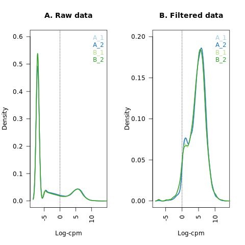
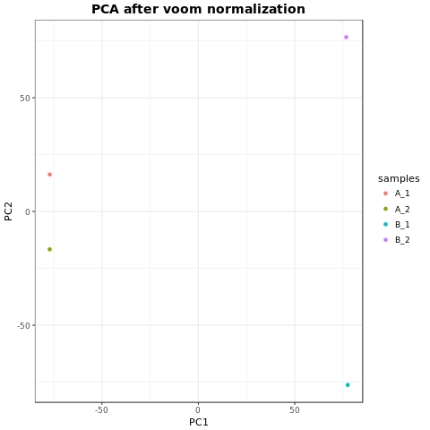

## Collecting genes reads count

```r
library(edgeR)
library(ggplot2)
library(cqn)
library(RColorBrewer)
library(pheatmap)
library(biomaRt)
library(org.Mm.eg.db)
library(clusterProfiler)
library(pathview)

# Collect expression data
A_1 <- read.table("./1.genes.results", sep='\t', header=T, stringsAsFactors=F, check.names=FALSE)
A_2 <- read.table("./2.genes.results", sep='\t', header=T, stringsAsFactors=F, check.names=FALSE)
B_1 <- read.table("./13.genes.results", sep='\t', header=T, stringsAsFactors=F, check.names=FALSE)
B_2 <- read.table("./14.genes.results", sep='\t', header=T, stringsAsFactors=F, check.names=FALSE)
# Extract expected reads count
exp <- merge(A_1[,c("gene_id", "expected_count")], A_2[,c("gene_id", "expected_count")], by="gene_id")
colnames(exp) <- c("gene_id", "A_1","A_2")
exp <- merge(exp, B_1[,c("gene_id", "expected_count")], by="gene_id")
exp <- merge(exp, B_2[,c("gene_id", "expected_count")], by="gene_id")
colnames(exp) <- c("gene_id", "A_1","A_2", "B_1", "B_2")
rownames(exp) <- exp[,1]
exp <- exp[,-1]
exp.full <- exp
# genes filter
keep <- rowSums(cpm(exp)>1) >= 2
exp <- exp[keep,]
```

### 12463 genes filtered which has a cpm of greater than 1 for at least two samples.

```r
nsamples <- ncol(exp)
col <- brewer.pal(nsamples, "Paired")
lcpm <- cpm(exp.full, log=TRUE)
lcpm1 <- cpm(exp, log=TRUE)
png(filename="./figures/data_filtering.png")
{par(mfrow=c(1,2))
plot(density(lcpm[,1]), col=col[1], lwd=2, ylim=c(0,0.6), las=2, 
     main="", xlab="")
title(main="A. Raw data", xlab="Log-cpm")
abline(v=0, lty=3)
for (i in 2:nsamples){
 den <- density(lcpm[,i])
 lines(den$x, den$y, col=col[i], lwd=2)
}
legend("topright", colnames(exp.full), text.col=col, bty="n")
plot(density(lcpm1[,1]), col=col[1], lwd=2, ylim=c(0,0.2), las=2, 
     main="", xlab="")
title(main="B. Filtered data", xlab="Log-cpm")
abline(v=0, lty=3)
for (i in 2:nsamples){
   den <- density(lcpm1[,i])
   lines(den$x, den$y, col=col[i], lwd=2)
}
legend("topright", colnames(exp), text.col=col, bty="n")}
dev.off()
```

### The density of log-CPM values for raw pre-filtered data (A) and post-filtered data (B)

## PCA to explore outliers

```r
PC <- prcomp(voom(t(exp))$E, scale.=T, center = T)
samples <- rownames(PC$x)
png(filename="./figures/PCA_outlier_analysis.png")
ggplot(data.frame(PC$x),aes(PC1,PC2,color=samples)) + 
  geom_point() +
  ggtitle("PCA after voom normalization") + 
  theme_bw() + 
  theme(plot.title = element_text(face="bold", color="black", size=14, hjust=0.5))
dev.off()
```

#### Samples in condition B are dissimilar though belonging to same group; decided to proceed with them coz of no other replicates

## Calculating genes GC content and length

#### Extracting gene coordinates

```perl
open(FILE, "<", "gencode.vM14.chr_patch_hapl_scaff.annotation.gtf");
open(OUT, ">", "gencode.vM14.chr_patch_hapl_scaff.annotation.bed");
while($line = <FILE>){
	if($line =~ /\tgene\t/){
		@cols = split('\t', $line);
		if($cols[8] =~ /gene_id\s\"(.*)\";\sgene_type.*/){
			print OUT "$cols[0]\t$cols[3]\t$cols[4]\t$1\n";
		}
	}
}
close(FILE);
close(OUT);
exit;
```
#### Using bedtools and emboss tool to calculate percentage GC content and length

```bash
bedtools getfasta -fi GRCm38.p5.genome.fa -bed gencode.vM14.chr_patch_hapl_scaff.annotation.bed -name -fo GRCm38_genes.fa
infoseq -auto -only -name -length -pgc GRCm38_genes.fa >GRCm38_length_gc.tsv
perl -pe 's/ +/\t/g' GRCm38_length_gc.tsv >GRCm38_length_gc_v1.tsv
```

## Conditional Quantile Normalisation (CQN)

### Initial normalisation usign cqn which remove the influence of GC content on counts, smooth the effect of gene length.

```r
# Collect gene length and GC content
GENE.LEN.GC <- read.table("./GRCm38_length_gc_v1.tsv", sep='\t', header=T, row.names = 1, stringsAsFactors=F, check.names=FALSE)
# filtering genes in expression data
GENE.GC <- data.frame(pgc_content = GENE.LEN.GC[rownames(exp), '%GC'], row.names = rownames(exp))
GENE.LEN <- data.frame(gene.length = GENE.LEN.GC[rownames(exp), 'Length'], row.names = rownames(exp))
CQN.GENE_EXPRESSION <- cqn(exp, 
                          x = GENE.GC$pgc_content,
                          lengths = GENE.LEN$gene.length,
                          lengthMethod = "smooth", 
                          verbose = FALSE)
CQN.GENE_EXPRESSION$E <- CQN.GENE_EXPRESSION$y + CQN.GENE_EXPRESSION$offset
png(filename="./figures/data_normalization.png")
{par(mfrow=c(1,2))
lcpm <- cpm(exp, log=TRUE)
boxplot(lcpm, las=2, col=col, main="")
title(main="A. Unnormalised",ylab="Log-cpm")
boxplot(CQN.GENE_EXPRESSION$E, las=2, col=col, main="")
title(main="B. CQN Normalised",ylab="Log-cpm")}
dev.off()
```
### Boxplots of log-CPM values showing expression distributions for unnormalised data (A) and normalised data (B)

## Differential expression analysis

### Dispersion control with voom

```r
# Construct design
group <- as.factor(c("A", "A", "B", "B"))
design <- model.matrix(~0+group)
colnames(design) <- gsub("group", "", colnames(design))
png(filename="./figures/mean-variance.png")
{par(mfrow=c(1,2))
# Estimate voom weights for dispersion control
VOOM.WEIGHTS <- voom(exp, design, plot=T)
# Fit linear model using weights and design
VOOM.WEIGHTS$E <- CQN.GENE_EXPRESSION$E
FIT <- lmFit(VOOM.WEIGHTS)
# Fit contrast
contrast <- makeContrasts(AvsB=A-B, levels = colnames(design))
FIT.CONTR <- contrasts.fit(FIT, contrasts=contrast)
FIT.CONTR <- eBayes(FIT.CONTR)
plotSA(FIT.CONTR, main="Final model: Mean−variance")}
dev.off()
# Get differential expression
DE <- topTable(FIT.CONTR, number = Inf, adjust.method = "BH", sort.by = "p")
```
#### The mean-variance relationship of log-CPM values for this dataset is shown in the left-hand panel. Typically, the voom-plot shows a decreasing trend between the means and variances resulting from a combination of technical variation in the sequencing experiment and biological variation amongst the replicate samples from different cell populations. Experiments with high biological variation usually result in flatter trends, where variance values plateau at high expression values. Experiments with low biological variation tend to result in sharp decreasing trends. The model’s residual variances are plotted against average expression values in the right-hand panel.

```r
# Get top 500 genes
DE_500 <- head(DE, 500)
DE.topgenes <- rownames(DE_500)
# Remove gene version number
DE.topgenes_1 <- sapply(strsplit(DE.topgenes, "[.]"), `[`, 1)
# Collect gene symbols from Ensembl
ensembl = useEnsembl(biomart="ensembl", version=89, dataset="mmusculus_gene_ensembl")
g_symb <- getBM(filters= "ensembl_gene_id", values=DE.topgenes_1, attributes=  c("ensembl_gene_id", "external_gene_name"),
                 mart= ensembl)
rownames(g_symb) <- g_symb$ensembl_gene_id
# Get genes in order as DE_500
g_symb <- g_symb[DE.topgenes_1,]
# Add gene name to DE_500
DE_500 <- cbind(ensembl_gene_id = rownames(DE_500), external_gene_name = g_symb$external_gene_name, DE_500)
# print top 10 genes
head(DE_500, 10)
write.table(DE_500, file = "./top_500_deg.txt", quote = FALSE, sep = "\t", row.names = FALSE)
```

### Plot the heat map showing the normalized expression of DE genes

```r
Samples = c("A", "A", "B", "B")
pheatmap(VOOM.WEIGHTS$E[DE.topgenes,],  color = colorRampPalette((brewer.pal(n = 9, name = "OrRd")))(9), border_color = NA, cellwidth = 20, cellheight = 3, show_colnames = T, annotation_col = data.frame(Samples, row.names = c("A_1", "A_2", "B_1", "B_2")), annotation_names_col = FALSE, labels_row = g_symb$external_gene_name, labels_col = group, filename = "./figures/heatmap.png", fontsize_row = 3, clustering_distance_cols = "euclidean", clustering_distance_rows = "euclidean")
```

## Gene ontology on the differentially expressed genes

```r
# Collect fold change of DE genes
fold <- setNames(DE_500[,"logFC"], DE.topgenes_1)
fold <- sort(fold, decreasing = T)
# Prepare Universal set
DE.genes <- rownames(DE)
# Remove gene version number
DE.genes_1 <- sapply(strsplit(DE.genes, "[.]"), `[`, 1)
# GO over-representation test
ego <- enrichGO(gene          = DE.topgenes_1,
                universe      = DE.genes_1,
                keytype       = 'ENSEMBL',
                OrgDb         = org.Mm.eg.db,
                ont           = "BP",
                pAdjustMethod = "BH",
                pvalueCutoff  = 0.01,
                qvalueCutoff  = 0.05,
                minGSSize     = 10,
                maxGSSize     = 500,
                readable      = TRUE)
# simplify enriched GO result
ego2 <- simplify(ego, cutoff=0.7, by="p.adjust", select_fun=min)
head(ego2, 10)
write.csv(ego2, file = "./gene_ontology.txt", quote = FALSE, row.names = FALSE)
```

```r
cnetplot(ego2, categorySize="pvalue", foldChange=fold, fixed = T)
```

## Pathway analysis on the differentially expressed genes

```r
# get uniprot ids
up_1 = bitr(DE.topgenes_1, fromType="ENSEMBL", toType=c("UNIPROT"), OrgDb="org.Mm.eg.db")
up = bitr(DE.genes_1, fromType="ENSEMBL", toType=c("UNIPROT"), OrgDb="org.Mm.eg.db")
# KEGG over-representation test
kk <- enrichKEGG(gene          =  up_1$UNIPROT,
                 universe      = up$UNIPROT,
                 organism      = 'mmu',
                 keyType       = "uniprot",
                 pAdjustMethod = "BH",
                 pvalueCutoff  = 0.01,
                 qvalueCutoff  = 0.05,
                 minGSSize     = 10,
                 maxGSSize     = 500)
head(kk, 5)
write.csv(head(kk, 5), file = "./pathway_analysis.txt", quote = FALSE, row.names = FALSE)
mmu04066 <- pathview(gene.data  = fold,
                     pathway.id = "mmu04066",
                     species    = "mmu",
                     limit      = list(gene=max(abs(fold)), cpd=1),
                     gene.idtype= "ENSEMBL")
```
